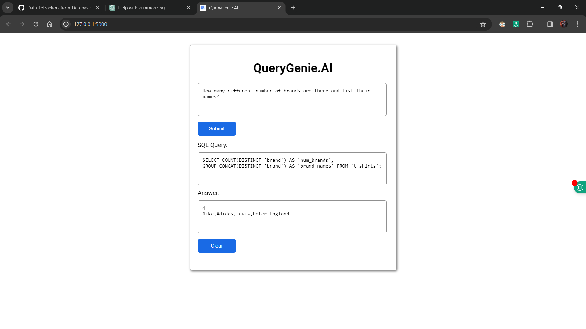

---

# QueryGenie.AI: Data Extraction from Database using AI

QueryGenie.AI is an AI-powered tool designed to facilitate data extraction from databases using natural language queries. Leveraging state-of-the-art language models and innovative technologies, QueryGenie.AI enables users to effortlessly retrieve desired data from databases without the need for expertise in SQL queries.

## Table of Contents

- [Introduction](#introduction)
- [Tools Used](#tools-used)
- [Project Overview](#project-overview)
- [Use Case](#use-case)
- [Code](#code)
- [Screenshots](#screenshots)

## Introduction

In this project, a large language model (LLM), specifically Google Gemini LLM, is integrated with a database using Langchain, a technology that bridges natural language processing with database querying. The user interface (UI) allows users to input their queries in natural language. The LLM then converts these queries into SQL queries, which are executed to retrieve the relevant data from the database. Both the generated SQL query and the corresponding answer are displayed to the user.

## Tools Used

- Jupyter Notebook
- Visual Studio Code (VS Code)
- MySQL
- Python
- Langchain
- Google Gemini LLM
- Chroma DB vector database
- Few Shot Learning
- Prompt Engineering
- Flask
- HTML
- CSS
- JavaScript

## Project Overview

QueryGenie.AI provides a user-friendly web-based interface for predicting diseases, including diabetes, heart disease, and breast cancer, using machine learning algorithms. The project aims to leverage the power of data-driven insights to assist healthcare professionals in diagnosing and prognosticating various medical conditions.

## Use Case

The primary use case of QueryGenie.AI is to assist individuals or organizations that rely on databases for storing their data but lack expertise in writing SQL queries. This tool serves as a cost-effective alternative to hiring data analysts, as it empowers users to extract data using simple natural language queries. Whether it's a small retail store, a large online retailer, or any organization managing data, QueryGenie.AI streamlines the process of data retrieval, saving time and resources.

## Code

```python
# Importing the dependencies 
from flask import Flask, render_template, request, jsonify
from backend.langchain_helper import get_langchain_output

# Creating the langchain object 
langchain_object = get_langchain_output()
 
# Creating the flask app   
app = Flask(__name__, template_folder="frontend/html", static_folder="frontend/css and js")

# Rendering the HTML web page on the route '\'
@app.route('/')
def index():
    return render_template('index.html')

# Creating route for processing and sending results to javascript
@app.route('/result', methods=['GET', 'POST'])
def predict():
    
    data = request.json
    question = data.get('question')
    answer = langchain_object.run(question)
    
    try:
        sql_query = answer['intermediate_steps'][1]
        final_answer = answer['intermediate_steps'][5]
    except:
        sql_query = "Some error occour."
        final_answer = "Some error occur."

    output_data = jsonify({'sql_query': sql_query, 'answer': final_answer})
    
    return output_data

# This is the basic syntax to call python code
if __name__ == '__main__':
    app.run(debug=True)
```

## Screenshots




